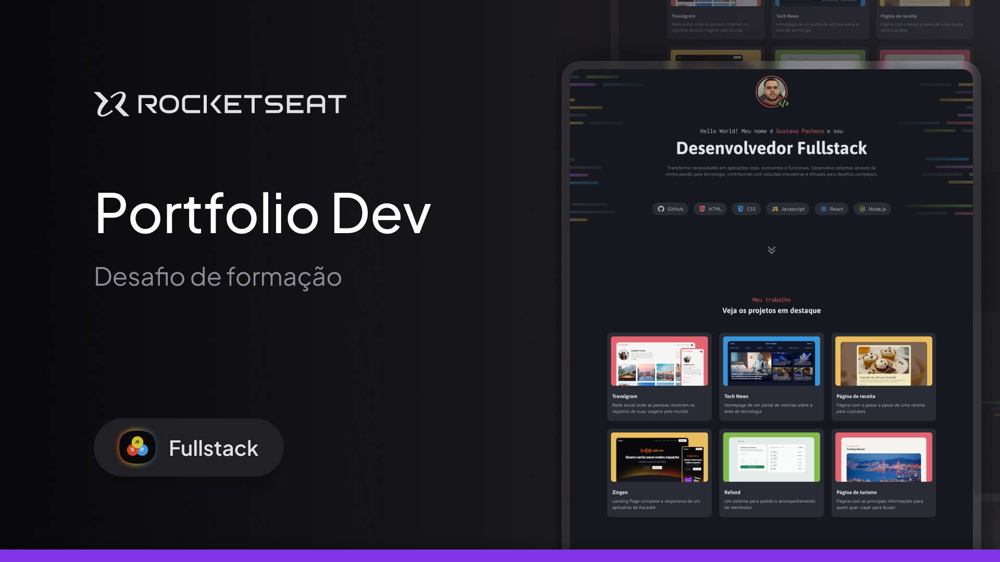

# 🚀 Desafio - Portfólio Pessoal

Este projeto faz parte do **Desafio Full Stack** da **Rocketseat** e consiste na criação de um **portfólio pessoal** moderno e profissional.

---

## 🖼️ **Layout do Projeto**


---

## 🎯 **Objetivo do Projeto**

- Desenvolver uma página web responsiva e estilizada.  
- Utilizar **HTML5** e **CSS3** para estruturar e estilizar o conteúdo.  
- Aplicar boas práticas de desenvolvimento web, incluindo organização de código e estruturação de arquivos.  

---

## 🖥️ **Tecnologias Utilizadas**

- **HTML5**  
- **CSS3**  
- **Flexbox e Grid** para layout responsivo  
- **Google Fonts** para tipografia moderna  
- **Design minimalista e profissional** inspirado na área de programação  

---

# 📂 Estrutura de Arquivos

/  
├── assets/  
│   ├── Background_Intro.png  
│   ├── Background_Contacts.png  
│   └── [Imagens dos projetos e serviços]  
├── styles/  
│   ├── global.css  
│   └── index.css  
├── index.html  
├── README.md  
│

---

## 🖌️ **Layout e Design**

- Esquema de cores **escuro com detalhes em azul neon** para um visual moderno e impactante.  
- Seções bem espaçadas para uma melhor experiência de leitura.  
- Elementos interativos com efeitos visuais para maior destaque.  

---

## 🔗 **Funcionalidades**

✅ Apresentação profissional com introdução e foto de perfil.  
✅ Seção com **projetos** destacados, incluindo uma breve descrição e links.  
✅ Seção de **serviços** com ícones e detalhes das soluções oferecidas.  
✅ Área de **contato** com botões diretos para redes sociais e e-mail.  

---

## 🚀 **Como Executar o Projeto**

1. **Clone este repositório:**  
```bash
git clone https://github.com/seu-usuario/nome-do-repositorio.git
```

2. **Acesse a pasta do projeto:**
```bash
cd nome-do-repositorio
```

3. **Abra o arquivo index.html diretamente no navegador.**

---

## 🏆 Desenvolvido por Gustavo Pacheco
💬 Gostou do meu trabalho?
Entre em contato ou explore mais projetos através das redes sociais disponíveis na seção de Contato! 😊

---

Feito com 💜 por Gustavopmb by Rocketseat 🚀
